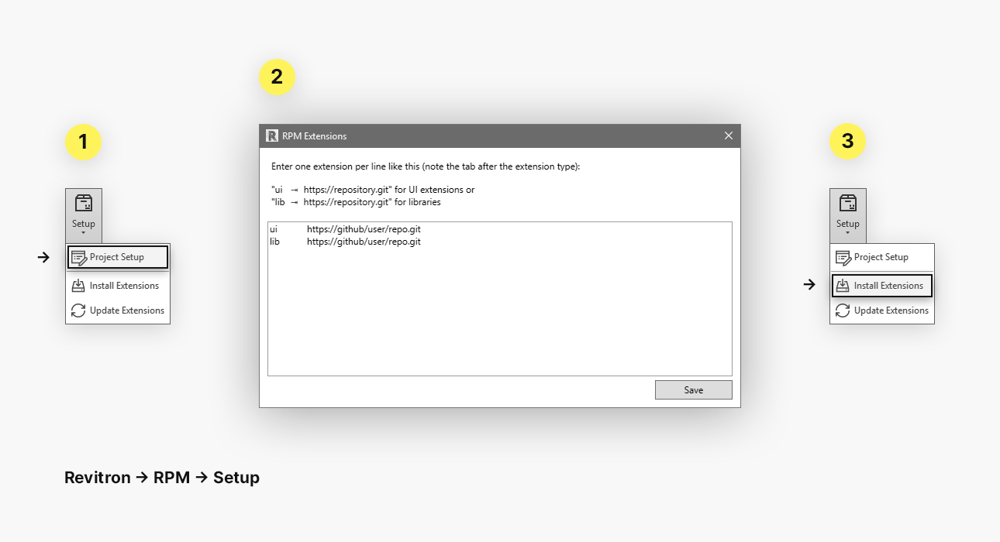

# RPM UI

The [pyRevit](https://github.com/revitron/pyRevit) UI extension for the project based [Revitron Package Manager](https://github.com/revitron/rpm).

## Installation

Note that the RPM UI requires the [Revitron](https://revitron.readthedocs.io/) and [RPM](https://github.com/revitron/rpm) to be installed as pyRevit extensions as well as [Git](https://git-scm.com/) for managing the repositories. 

### Bundle Installation

The easiest way of getting things running is to install the full Revitron bundle using the bundle installer. Follow the instructions [here](https://github.com/revitron/installer) to get started quickly.

### Manual Installation Using the pyRevit CLI

Alternatively you can also install the required extensions manually. 

    cd path\to\pyrevit
    pyrevit extend lib revitron https://github.com/revitron/revitron.git --dest=extensions
    pyrevit extend lib rpm https://github.com/revitron/rpm.git --dest=extensions
    pyrevit extend ui rpm-ui https://github.com/revitron/rpm-ui.git --dest=extensions

## Usage

By using the RPM, it is possible to define dependecies &mdash; pyRevit extensions &mdash; for Revit projects. The list of required extensions gets stored with a document. Therefore it is possible to easily switch environments when working with different projects.

To only update installed extensions without re-installing them, the **Revitron > RPM > Setup > Update Extensions** button can be used.

---

&copy; 2020, Marc Anton Dahmen &mdash; MIT license